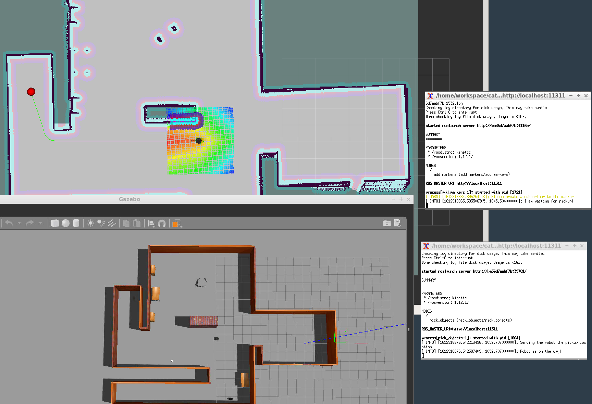
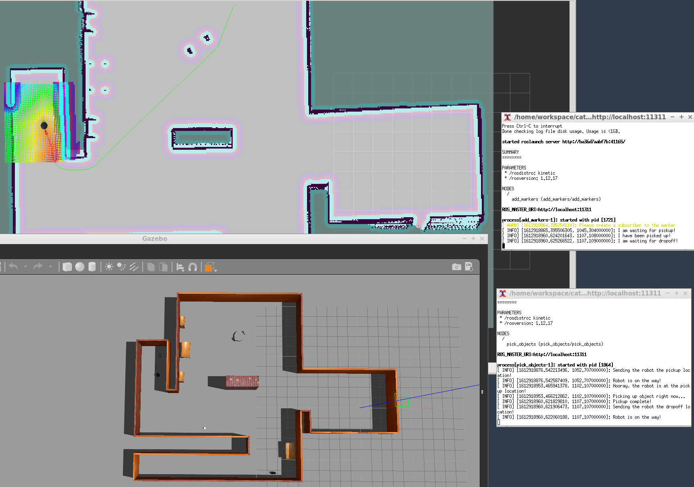
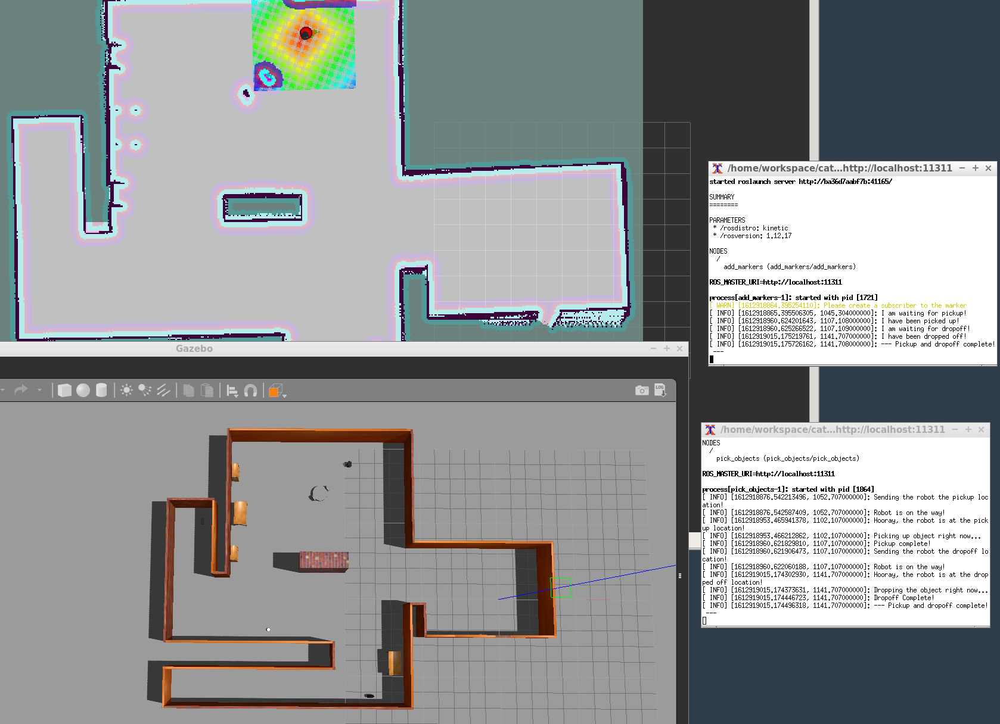

# RoboticsND_Home_Service_Robot
Develop a home service robot that utilizes localization, mapping, and navigation. The robot will go pickup and dropoff objects at your request. 

### Start of the program. Robot is going toward the pickup location.



### The robot has reached the pickup location and is picking up the object. After picking the object up, he is heading toward the dropoff location.



### The robot has reached the dropoff location and is dropping the object off.


The purpose of this final project was to apply all the skills we had gained throughout the course into one project. We were challenged to developing ROS nodes in C++ to send messages between different nodes that carry out different tasks. Furthermore, these nodes were incorporated alongside the use of official ROS packages. A combination of official and user built packages helped the robot carry out tasks of localization, mapping, and navigation. A further review is listed below:
- Localiztion: 
  - To achieve localization, the probabilistic AMCL based amcl_demo from the turtlebot_gazebo package was used. This method was derived from the turtlebot_gazebo package and helped aid the robot in localizing itself.
  - To test localization, please see the 'Navigation' bullet.
- Mapping:
  - To achieve mapping, the SLAM based gmapping_demo program from the turtlebot_gazebo package was used. This method allowed the turtlebot to map its environment and generate a 2-D occupancy map.
  - To test localization, after completing the instructions, run the following:
  ```
  cd /***preferred directory***/catkin_ws
  src/scripts/test_slam.sh
  ```
- Navigation:
  - To achieve navigation, once again, the probabilistic AMCL based amcl_demo from the turtlebot_gazebo package was used. Incorparating the 2D Navigation Goal from RVIZ, the turtlebot was able to localize itself and autonomously navigate to the destination.
  - To test navigation, after completing the instructions, run the following:
  ```
  cd /***preferred directory***/catkin_ws
  src/scripts/test_navigation.sh
  ```

## Dependencies
- Make sure your system is up to date:
```
sudo apt-get update && apt-get upgrade
```
- Double check to see if pyyaml and rospkg are both installed.
```
pip install pyyaml
pip install rospkg
```
- You will need xterm to properly run the shell scripts. 
```
sudo apt-get install xterm
```
- Grant the shell scripts execute permission. Run these lines after step 4 from the Instructions is completed
```
cd /***preferred directory***/catkin_ws/src/scripts
chmod +x test_slam.sh
chmod +x test_navigation.sh
chmod +x pick_objects.sh
chmod +x add_markers.sh
chmod +x home_service.sh
```

## Instructions

1. Create and initialize a catkin workspace `catkin_ws`
```
mkdir -p /***preferred directory***/catkin_ws/src  
cd /***preferred directory***/catkin_ws/src  
catkin_init_workspace  
```

2. Clone this repo to a different directory and copy all the files to `catkin_ws/src`
```
cd /***preferred directory***/
git clone https://github.com/azzamshaikh/RoboticsND_Home_Service_Robot.git  
```

4. Add the following packages to the `src` directory
```
cd /***preferred directory***/catkin_ws/src  
git clone https://github.com/ros-perception/slam_gmapping.git
git clone https://github.com/turtlebot/turtlebot.git
git clone https://github.com/turtlebot/turtlebot_interactions.git
git clone https://github.com/turtlebot/turtlebot_simulator.git
````

5. Build, source, and run the project
```
cd /***preferred directory***/catkin_ws
catkin_make
source devel/setup.bash
src/scripts/home_service.sh
```
